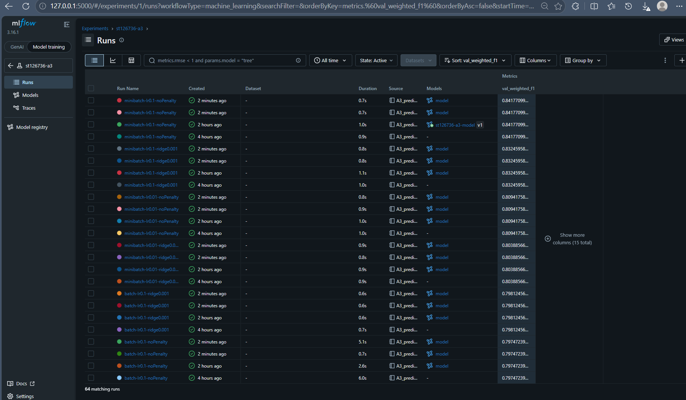
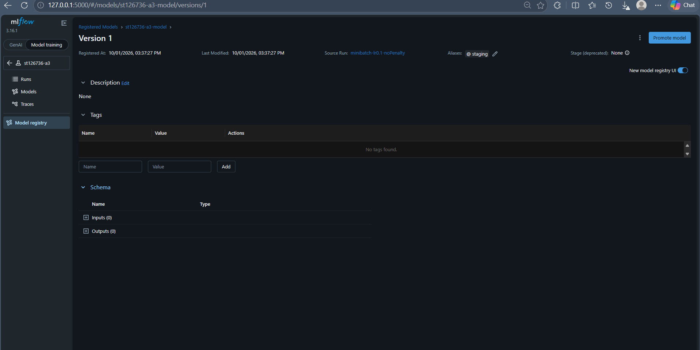
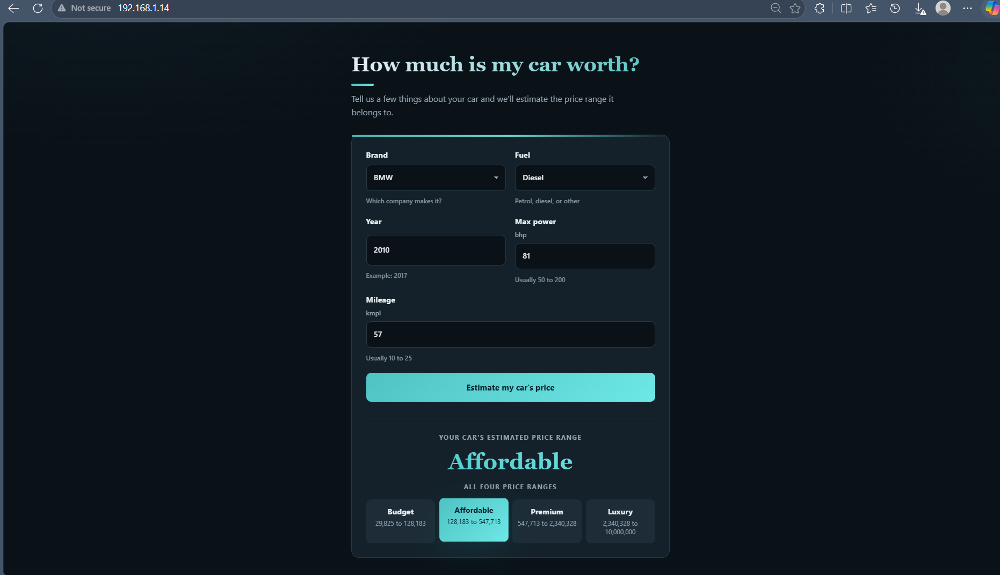
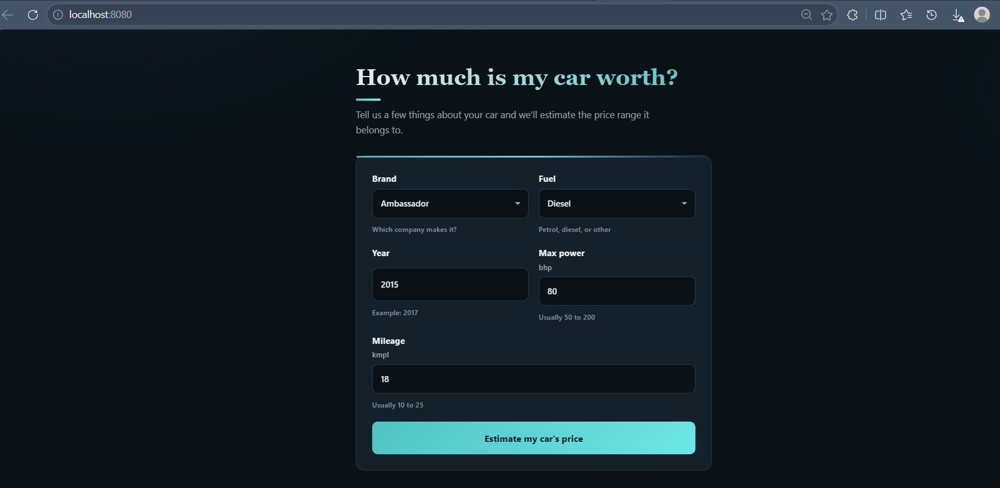

# A3: Predicting Car Price (Classification)

Multinomial logistic regression with an optional Ridge (L2) penalty, written from scratch, tracked with MLflow, and deployed with Flask + Docker + GitHub Actions.

**Student:** Jarin Tasnim Rodoshi (st126736), AT82.03 Machine Learning

## Overview

The Car Price dataset from A1 and A2 is treated here as a **4-class classification problem**: `selling_price` is bucketed into **Budget / Affordable / Premium / Luxury**. The model is trained and evaluated in `A3_predicting_car_price.ipynb`, served through a Flask web app packaged with Docker, and tested and deployed by GitHub Actions.

> **Note on MLflow:** the course MLflow server was unavailable during this assignment, so a local MLflow instance backed by `mlflow.db` was used instead, as allowed by the revised instructions. Experiment `st126736-a3`, registered model `st126736-a3-model`, alias `staging`. Screenshots are in `docs/`.

## Task 1: Classification

`selling_price` is converted to 4 classes with `pd.cut()` on `log(selling_price)` (equal-width bins in log-space, because raw prices are heavily right-skewed).

`app/logistic_regression.py` implements from scratch: `accuracy`, per-class `precision` / `recall` / `f1_score`, `support`, and the `macro_*` and `weighted_*` averages. On mock imbalanced data every value matches `sklearn.metrics.classification_report` to 4 decimal places (checked with `np.allclose` in the notebook).

**What does `support` mean?** The number of true samples of each class in the evaluated data. It shows how reliable each class's metrics are and is the weight used by the weighted average.

## Task 2: Ridge penalty

`LogisticRegression(use_penalty=True, lambda_=...)` adds `lambda * sum(theta^2)` to the loss and `2 * lambda * theta` to the gradient. The bias is not penalised. At lambda = 0.1 the weights shrink about 18x (sum of squares 15.86 to 0.90).

## Task 3: MLflow, registry, CI/CD

1. **MLflow logging:** 16 runs (batch / mini-batch x alpha 0.1, 0.01 x no penalty / Ridge lambda 0.001, 0.01, 0.1), logged locally. Dataset not logged; model saved as an artifact.
2. **Model registry:** the best run (highest validation weighted F1) is registered as `st126736-a3-model` (v1) with alias `staging`.
3. **CI/CD:** `.github/workflows/ci-cd.yml` runs the 2 unit tests on every push. If they pass on `main`, the Docker image is built and deployed.

## Results

Model selection uses the validation set. Test metrics are reported for every run but never used to choose the model. All 16 runs, sorted by validation weighted F1:

| # | Run | Val weighted F1 | Test accuracy |
|---|---|---|---|
| 1 | **minibatch-lr0.1-noPenalty** | **0.8418** | **0.8481** |
| 2 | minibatch-lr0.1-ridge0.001 | 0.8325 | 0.8418 |
| 3 | minibatch-lr0.01-noPenalty | 0.8094 | 0.8294 |
| 4 | minibatch-lr0.01-ridge0.001 | 0.8039 | 0.8269 |
| 5 | batch-lr0.1-ridge0.001 | 0.7981 | 0.8138 |
| 6 | batch-lr0.1-noPenalty | 0.7975 | 0.8132 |
| 7 | minibatch-lr0.1-ridge0.01 | 0.7720 | 0.7920 |
| 8 | minibatch-lr0.01-ridge0.01 | 0.7682 | 0.7846 |
| 9 | batch-lr0.1-ridge0.01 | 0.7590 | 0.7790 |
| 10 | batch-lr0.01-noPenalty | 0.6997 | 0.7403 |
| 11 | batch-lr0.01-ridge0.001 | 0.6997 | 0.7403 |
| 12 | batch-lr0.01-ridge0.01 | 0.6936 | 0.7410 |
| 13 | batch-lr0.01-ridge0.1 | 0.6660 | 0.7229 |
| 14 | minibatch-lr0.1-ridge0.1 | 0.6656 | 0.7098 |
| 15 | minibatch-lr0.01-ridge0.1 | 0.6646 | 0.7173 |
| 16 | batch-lr0.1-ridge0.1 | 0.6639 | 0.7173 |

**Best model:** `minibatch-lr0.1-noPenalty`: test accuracy 0.8481, test weighted F1 0.8473, test macro F1 0.8402.

Findings:
- Mini-batch beat batch at every matched setting (+4.4 points of validation weighted F1 for the best runs).
- alpha = 0.1 beat alpha = 0.01 within 500 iterations.
- Ridge only hurt on this data (35 features, 5,137 training samples, so the model is not over-parameterised).
- The weakest class is Budget (recall 0.65).

## What the app does

A single-page Flask form takes **brand, fuel, year, max power and mileage** and returns the predicted price class (Budget / Affordable / Premium / Luxury) with its price range.

## Screenshots

**MLflow runs, experiment `st126736-a3`**



**Registered model `st126736-a3-model`, alias `staging`**



**Flask app (local)**



**Docker (`localhost:8080`)**




## Project structure

```
A3_predicting_car_price.ipynb   # tasks 1-3, experiments, full report
Cars.csv                        # dataset
mlflow.db                       # local MLflow backend (runs + registry)
requirements.txt
docs/                           # screenshots
app/                            # Flask web app, model class, tests
  app.py, logistic_regression.py, mlflow_wrapper.py
  Model/                        # model.pkl + preprocess.pkl (created by the notebook)
  templates/index.html
  tests/test_model.py           # 2 unit tests
Dockerfile
docker-compose.yaml
.github/workflows/ci-cd.yml
```

## Run it

```bash
pip install -r requirements.txt
jupyter notebook A3_predicting_car_price.ipynb   # run all cells -> creates app/Model/*
python -m mlflow ui --backend-store-uri sqlite:///mlflow.db   # http://127.0.0.1:5000
pytest app/tests -v                              # unit tests
cd app && PORT=8050 python app.py                # local app
docker compose up --build                        # Docker: http://localhost:8080
```

## GitHub secrets needed for deployment

`DOCKERHUB_USERNAME`, `DOCKERHUB_TOKEN`, `SSH_HOST`, `SSH_USER`, `SSH_PRIVATE_KEY`